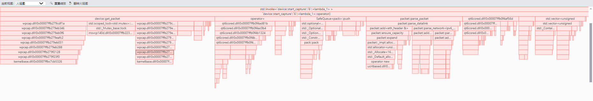
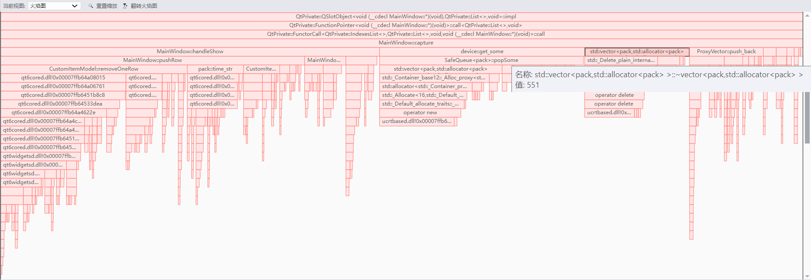
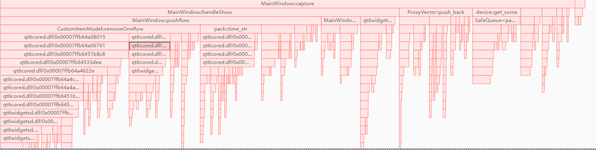
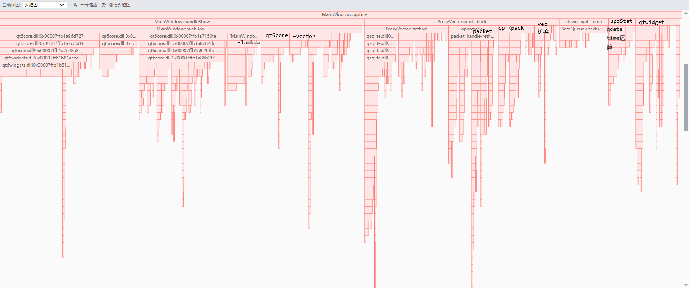
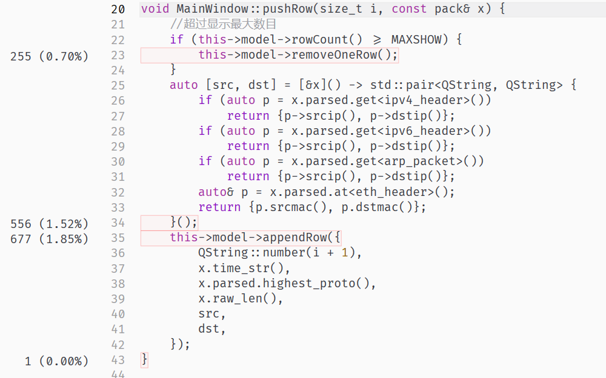
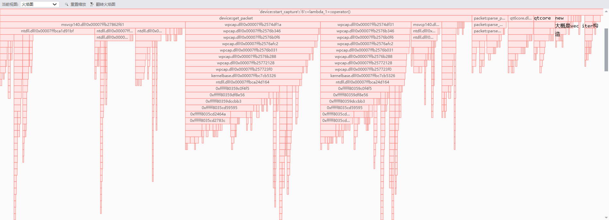
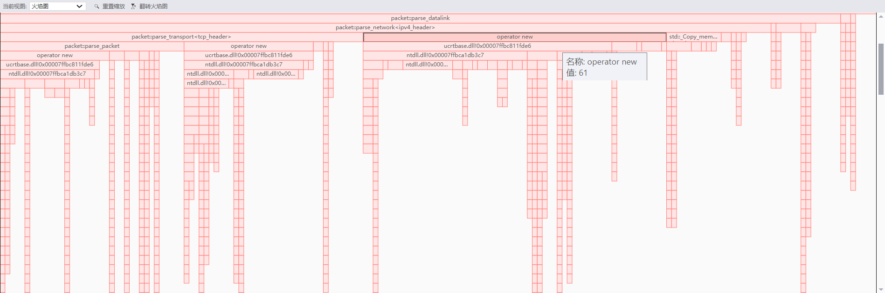

#
## 脑内优化

blobCache
ProxyVector存档条件：
大于一定长度 且 存档cd(冷却时间)结束

packet建模为
kn..-k2-k1:v1-v2-..vn
共享一块双向扩容内存

协议最多只有一个变长字段且在最后，用`n+arr[0]`建模

ProxyVector弃用所有反射

使用sql索引rowid

sqlite3_limit(db,SQLITE_LIMIT_LENGTH,size)也有优化，但是qt如果要用sqlite裸api太麻烦了（也不麻烦？找到对应版本的sqlite然后qsqldriver::handle取出裸sqlite-handle就可以了。。据说还要sqlite3_initialize..
总之先不做。。

sqlite有without rowid。。看了看直接用rowid当主键就好了。without rowid用b树，而rowid用b*树(叶子结点存信息)。所以用rowid

~~ProxyVector换页时，取 以i为中心前后LENGTH/2 的页~~ 迭代时太浪费了，普通的以i向pagesize下取整为起点就好

filter做好了！大成功！！

适配filter

常数互质一下，以免碰撞导致峰值耗时突然增高

做个get_some，以免处理展示包太久卡死图形界面

## 真-性能优化

局部火焰图，总体火焰图没发现MWcapture, 多线程parse居然比MWcapture更瓶颈
QDateTime + std::chrono::milliseconds 慢的要死。。居然跟parse_packet一个速度。。
parse_packet(parse_datalink)有一半慢在packet.add上，完全是因为扩容时的内存分配与回收。。离谱，暂时不理

改进后：

线程分析看到在1s内突发流量在10000个包以下时，parse多线程cpu占比不超过0.5%，在火焰图上已经找不到
主线程占比99.5%，MW::capture()占比14%，主要耗在：qt界面，vector的构造/析构，序列化存档。
vector的无参构造因为debug版所以真的慢。。

但序列化存档完全不是瓶颈，只占MW::capture()的7%，几乎和vector析构差不多效率，赢麻了

更高流量冲击下：10000个包/s以上，3M/s吧大概，主线程占比达到100%，解析报文线程忽略不计了
MW::capture()占总比达到27%。（有可能挂后台了所以qt渲染轻松了一点？
MW::capture()分布还是那样，锅都在qt

**removeOneRow单次复调太多次了。。用RAII的东西包装成批量操作之类的吧。。**

加个判断，改善handleShow里的setMaxPage耗时

## 小更新
开/Wall清理一下warning，主要是整数类型转换

更新后
大压测下MW::capture占总比变为18%。全部parse多线程占总比达到1.7%

## 大更新：为了行为定义，packet建模换为vector any，回来吧我的反射
低压，主线程占99.7%，多线程火焰图上看不到
MW::capture占主线程11%，性能分布还是差不多那样

## release性能
极高压，突然到了六位数那种
cpu最高到达30%
MW::capture和device::start_capture均可见，而且比例为28:30
程序总量为365，算下来两者差不多都占了8%

序列化成为可观的耗时。(8:365)

合理怀疑qdatetime运算真的有严重的性能问题，虽然占总比可以忽略
ip字符串化里的strlen有点拖后腿，删了好了

parse_packet里面new确实是性能瓶颈了。但是parse_packet本身占比很小所以忽略

